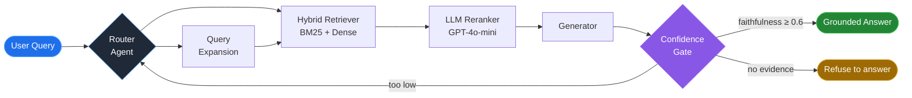

<div align="center">
  
</div>

<div align="center">
  <a href="https://github.com/vinhhuy12">
    
  </a>
</div>

<div align="center">

[](mailto:huythi121022@gmail.com)
[](https://linkedin.com/in/YOUR-HANDLE)
[](https://YOUR-SITE.com)
[](#)


</div>

<br>

## 👋 Về tôi / About me


```yaml
name:      Thi Vinh Huy
role:      AI Engineer @ DFM Company
based_in:  Ho Chi Minh City, Vietnam
focus:     Multi-agent orchestration · RAG · Vietnamese NLP
next:      M.Sc. Computer Science @ UIT - VNU-HCM (2026)
```

- 🔭 **Hiện tại** — xây hệ multi-agent biến ngôn ngữ tự nhiên (EN/FR/VI) thành **mô hình CAD 3D**, phục vụ 100+ người dùng đồng thời.
- 🧠 **Tôi làm gì** — tôi không ghép prompt. Tôi thiết kế phần *quyết định xem câu trả lời có đủ tốt để trả về hay không*: hybrid retrieval, LLM reranking, confidence gate, self-healing loop.
- 🌱 **Đang học** — LLM self-hosting, agent evaluation, và chuẩn bị hướng nghiên cứu Thạc sĩ: **citation-grounded generation cho tiếng Việt**.
- 💬 **Hỏi tôi về** — RAG chạy thật trong production, vì sao chatbot của bạn "ảo giác", cách đo chất lượng agent bằng số thay vì cảm tính.
- ⚡ **Niềm tin nghề nghiệp** — *phần lớn "hallucination" chỉ là một cú trượt retrieval đội lốt.*

<br clear="right"/>

---

## 🏗️ Hệ thống tôi xây trông như thế nào



> **Vòng lặp ngược mới là phần khó.** Một hệ thống không biết nói *"tôi không biết"* thì chưa sẵn sàng cho production.

---

## 💼 Kinh nghiệm / Experience

<table>
<tr>
<td width="130" align="center" valign="top">
<br>
<br><br>
<b>AI<br>Engineer</b>
</td>
<td valign="top">

### Tolery API AI — **DFM Company**

Hệ multi-agent chuyển **ngôn ngữ tự nhiên → mô hình CAD 3D**, đa ngôn ngữ EN/FR/VI.

| Tôi đóng góp gì | Kết quả |
|---|---|
| Decision engine điều phối các agent async chạy song song | 100+ concurrent users |
| Dual-context FAISS retrieval + LLM query expansion + reranking | Truy hồi đúng ngữ cảnh kỹ thuật |
| **Self-healing loop**: phát hiện lỗi thực thi → tự vá → chạy lại | Giảm can thiệp thủ công |
| SSE streaming + JWT auth, deploy Docker + GitLab CI/CD | Phản hồi real-time |

</td>
</tr>
</table>

---

## 🚀 Dự án / Projects

<table>
<tr>
<td width="50%" valign="top">

### 🎓 UIT Admission Chatbot
**Multi-Agent RAG · Song ngữ**

[](https://github.com/vinhhuy12/REPO-NAME)

Chatbot tư vấn tuyển sinh, kiến trúc multi-agent với cổng kiểm chứng trước khi trả lời.

**⚡ Latency 14s → 8s (−40%)**

Chạy song song *speculative*: routing + query expansion + preload retriever cùng lúc, bỏ nhánh thua.

| | |
|---|---|
| Faithfulness | **≥ 0.6** enforced tại serve-time |
| Reranker | GPT-4o-mini cho tiếng Việt, **0 RAM** |
| Conversation | Intent + trả lời song ngữ trong **1 LLM call** |
| Eval | RAGAS 4 metric · golden set 15+ Q&A |
| Trace | LangSmith full tracing |

`LlamaIndex` `Elasticsearch` `GPT-4o` `FastAPI` `RAGAS` `AWS`

</td>
<td width="50%" valign="top">

### 🪪 ID Card Extraction Pipeline
**Computer Vision · OCR**

[](https://github.com/vinhhuy12/REPO-NAME)

Pipeline 2 tầng đọc CCCD: phát hiện chip → trích xuất 9 trường thông tin.

**🎯 94% accuracy · 3 phút → 5 giây (−96%)**

Thay thế hoàn toàn khâu nhập liệu thủ công.

| | |
|---|---|
| Tầng 1 | Detect chip CCCD |
| Tầng 2 | YOLO ensemble, 9-class field |
| Hậu xử lý | OCR correction + validation |
| Phục vụ | FastAPI endpoint |

`YOLOv8` `Detectron2` `Tesseract` `OpenCV` `FastAPI`

<br>

### 🧾 AuditFlow `đang làm`
**Multi-agent audit review**

Hệ agent rà soát hồ sơ kiểm toán. Nguyên tắc thiết kế: **độ tin cậy tỉ lệ nghịch với mức độ LLM tham gia.**

</td>
</tr>
</table>

---

## 🛠️ Công nghệ / Tech Stack

<div align="center">

**Dùng hằng ngày**


**Thành thạo**


</div>

---

## 📊 Thống kê GitHub

<div align="center">


<br><br>


</div>

<div align="center">
  <picture>
    <source media="(prefers-color-scheme: dark)" srcset="https://raw.githubusercontent.com/vinhhuy12/vinhhuy12/output/github-contribution-grid-snake-dark.svg" />
    <source media="(prefers-color-scheme: light)" srcset="https://raw.githubusercontent.com/vinhhuy12/vinhhuy12/output/github-contribution-grid-snake.svg" />
    
  </picture>
</div>

---

## 🎓 Học vấn / Education

<table>
<tr>
<td align="center" width="50%">

### M.Sc. Computer Science
**UIT — VNU-HCM** · `2026 →`

Hướng nghiên cứu: retrieval precision &
citation-grounded generation cho tiếng Việt

</td>
<td align="center" width="50%">

### B.Sc. Computer Science
**UIT — VNU-HCM** · `2021 – 2025`

GPA 3.0/4.0 · TOEIC 600 (L&R)
Thành viên **AI Club UIT**

</td>
</tr>
</table>

---

<div align="center">

### 💬 Đang mở cơ hội **AI Engineer** — TP.HCM hoặc remote

[](mailto:huythi121022@gmail.com)
[](https://linkedin.com/in/YOUR-HANDLE)

<br>

> *"Retrieval precision, reasoning accuracy, output verifiability — that's the bar."*


</div>
